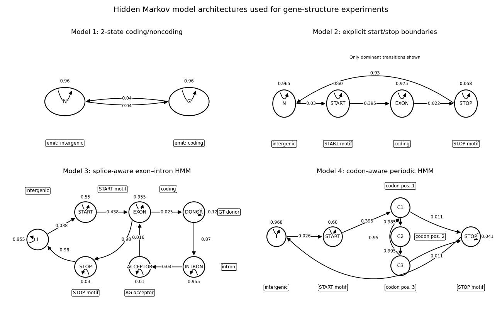

# HMM Gene Structure Benchmarking

This project builds and evaluates several Hidden Markov Models (HMMs) to identify gene-structure features in synthetic prokaryotic and eukaryotic DNA sequences. The models are compared using metrics such as coding accuracy, sensitivity, specificity, boundary detection, splice-site detection, and runtime.

## Files

- hmm.py  
  Defines the main HMMModel class and implements the Viterbi algorithm.

- models.py  
  Builds four HMM architectures:
  1. Coding vs noncoding
  2. Start/Exon/Stop states
  3. Splice-aware exon-intron model
  4. Codon-aware periodic model

- data_generation.py  
  Generates synthetic DNA sequences and labels.

- mappings.py  
  Maps detailed labels into each model’s label space.

- eval_utils.py  
  Does the evaluation metrics and benchmarking.

- io_utils.py  
  Handles printing, CSV saving, and formatting outputs.

- main_analysis.py  
  Runs the main benchmarking pipeline and generates plots.

- make_diagrams.py  
  Generates visual diagrams of the HMM architectures (used in report)

## Running the Main Analysis

Run:
    python main_analysis.py

This will:
- Generate the synthetic data
- Run all the models
- Print results and save CSV and plots to outputs/

## Optional Arguments

    --n-prok        number of prokaryote examples
    --n-euk         number of eukaryote examples
    --seed          random seed
    --outdir        output directory

## Generating Diagrams

Run:

    python make_diagrams.py

This creates:

    hmm_models_paper_diagram.png

The diagram shows the state diagram for all four models as show here.
